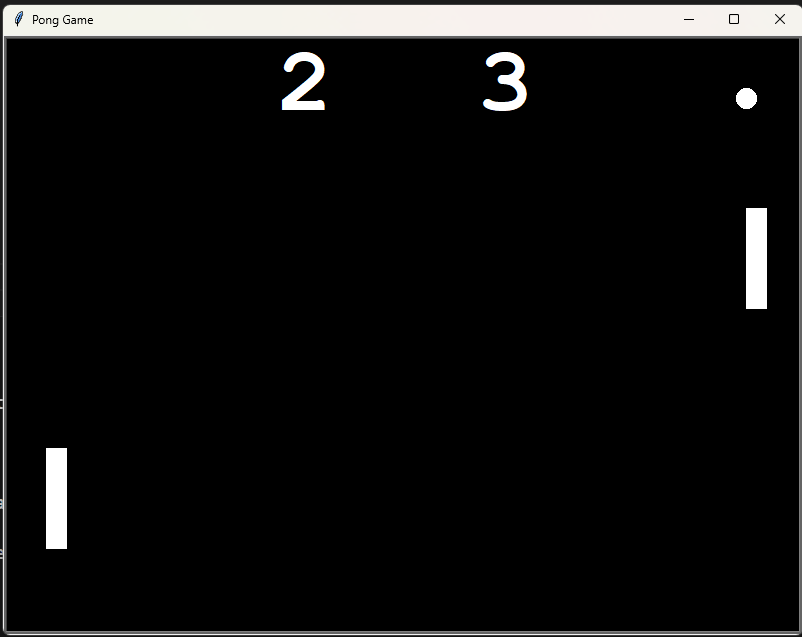

# Pong Game 🏓

A simple Pong game built using Python's Turtle module as part of the **100 Days of Code** course by Dr. Angela Yu.

## 🎮 How to Play

- **Player 1 (Left Paddle):** Move up with `W`, move down with `S`
- **Player 2 (Right Paddle):** Move up with `Up Arrow`, move down with `Down Arrow`
- The ball bounces off the walls and paddles.
- If a player misses the ball, the opponent scores a point.

## 🛠️ Setup

1. Clone this repository:
   ```sh
   git clone https://github.com/mevaser/pong-game.git
   ```
2. Navigate into the project folder:
   ```sh
   cd pong-game
   ```
3. Create a virtual environment (optional but recommended):
   ```sh
   python -m venv venv
   ```
4. Activate the virtual environment:
   - **Windows:** `venv\Scripts\activate`
   - **Mac/Linux:** `source venv/bin/activate`
5. Install dependencies:
   ```sh
   pip install -r requirements.txt
   ```
6. Run the game:
   ```sh
   python main.py
   ```

## 🚀 Features

- Simple and fun gameplay
- Speed increases with each paddle hit
- Score tracking

## 📷 Screenshot



## 📜 License

This project is open-source. Feel free to modify and improve it! 🚀
